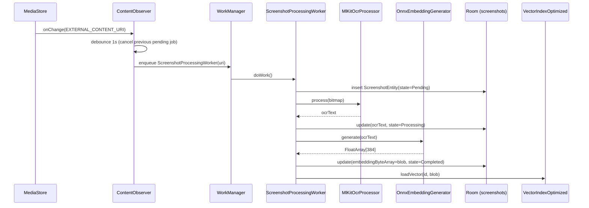
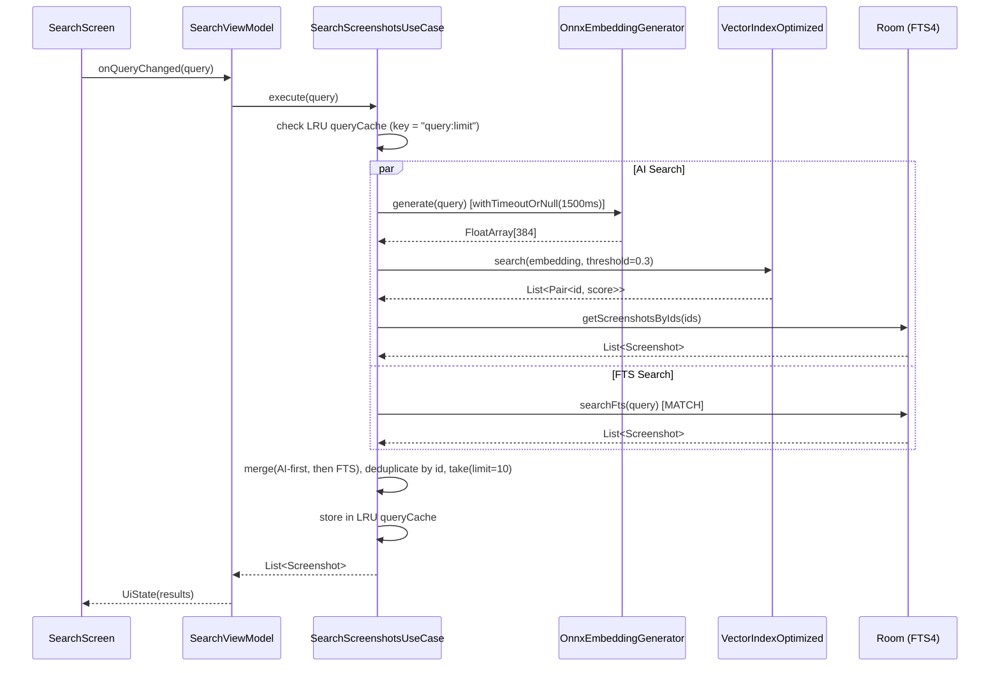

# Recall — Software Architecture Document

> Date: June 2026 | Status: Active | Version: 1.0

---

## Purpose and Scope

This document is the canonical Software Architecture Document (SAD) for the Recall Android application. It supersedes all previous Technical Requirements Documents (TRD), Product Requirements Documents (PRD), UI/UX Design Documents, Android-Specifics documents, Hardware Guides, Model Choice documents, and Data Privacy documents. Those source files have been deleted; this SAD is the single source of truth.

**Recall** is a privacy-first, fully on-device Android app that automatically indexes screenshots via OCR and semantic embedding, enabling natural-language and keyword search over a user's personal screenshot library — with zero data leaving the device.

**In scope:** architecture, data model, ML pipeline, background processing, UI structure, cross-cutting concerns, and architecture decisions for v1.0.

**Out of scope:** video indexing, cloud sync, translation, AI chat/RAG, backend services.

---

## Technical Context

| Attribute              | Value                                                                 |
|------------------------|-----------------------------------------------------------------------|
| **Platform**           | Android                                                               |
| **Min SDK**            | API 26 (Android 8.0)                                                  |
| **Target SDK**         | API 34 (Android 14)                                                   |
| **Version**            | 1.1.0 (versionCode 2)                                                 |
| **Language**           | Kotlin 1.9.22                                                         |
| **JVM Target**         | Java 17                                                               |
| **UI Framework**       | Jetpack Compose — BOM 2024.06.00                                      |
| **Architecture**       | Clean Architecture + MVI (Model-View-Intent)                          |
| **DI**                 | Hilt 2.50                                                             |
| **Database**           | Room 2.6.1, SQLite (v5), FTS4                                         |
| **Background**         | WorkManager 2.9.0                                                     |
| **ML Inference**       | ONNX Runtime 1.16.0 (android) + extensions 0.10.0                    |
| **OCR**                | ML Kit Text Recognition 16.0.0 (model auto-downloaded on install)     |
| **Embedding Model**    | bge-small-en-v1.5 — FP32 133 MB (≥8 GB RAM) / INT8 34 MB (<8 GB)    |
| **Image Loading**      | Coil 2.6.0                                                            |
| **HTTP**               | OkHttp 4.12.0 (model download only)                                  |
| **Navigation**         | Navigation Compose 2.7.7                                              |
| **Preferences**        | DataStore Preferences 1.0.0                                           |
| **Coroutines**         | kotlinx.coroutines 1.7.3                                              |
| **Build**              | KSP, Gradle Kotlin DSL                                                |
| **Minification**       | R8/ProGuard enabled in release builds                                 |
| **Module structure**   | Single `:app` module (see ADR-0001)                                   |

---

## System Scope and Context

### C4 System Context

```
C4Context
    title Recall — System Context

    Person(user, "User", "Android device owner who takes screenshots")

    System(recall, "Recall App", "Indexes and semantically searches screenshots on-device")

    System_Ext(mediastore, "MediaStore", "Android system media database")
    System_Ext(mlkit_cdn, "Google Play Services
(ML Kit OCR model)", "Delivers OCR model at install time via Play Store metadata")
    System_Ext(huggingface, "HuggingFace CDN
(huggingface.co)", "Hosts ONNX embedding model files for user-initiated download")

    Rel(user, recall, "Takes screenshots; searches memories")
    Rel(recall, mediastore, "Reads image URIs via ContentObserver", "ContentResolver")
    Rel(recall, mlkit_cdn, "Downloads OCR model on install", "HTTPS (Play Store)")
    Rel(recall, huggingface, "Downloads ONNX model on demand", "HTTPS / OkHttp")
```

### C4 Container View

```
C4Container
    title Recall — Container View

    Person(user, "User")

    Container_Boundary(app, "Recall App (single :app module)") {
        Container(ui, "Presentation Layer", "Jetpack Compose + ViewModels", "Screens, MVI state management, Coil image loading")
        Container(domain, "Domain Layer", "Kotlin / Coroutines", "Use cases, domain models, repository interfaces")
        Container(data, "Data Layer", "Room / WorkManager / ONNX", "Repositories, DAO, workers, NLP pipeline")
        ContainerDb(db, "Room Database
(recall_db v5)", "SQLite", "screenshots, screenshots_fts, search_history tables")
        ContainerDb(datastore, "DataStore Preferences", "Proto DataStore", "Theme, cache limit, model path, indexing prefs")
        Container(vectoridx, "VectorIndexOptimized", "In-memory (JVM heap)", "LRU-bounded HNSW-style cosine similarity index")
        Container(workers, "WorkManager Workers", "WorkManager 2.9.0", "ScanExisting, BackgroundOcr, ScreenshotProcessing, ModelDownload")
        Container(onnx, "ONNX Runtime", "Native .so", "Runs bge-small-en-v1.5 inference for embedding generation")
        Container(ocr, "ML Kit OCR", "Google Play Services", "Extracts text from screenshot bitmaps")
    }

    System_Ext(mediastore, "MediaStore")
    System_Ext(huggingface, "HuggingFace CDN")

    Rel(user, ui, "Interacts with", "Touch / Navigation")
    Rel(ui, domain, "Invokes use cases")
    Rel(domain, data, "Calls repository implementations")
    Rel(data, db, "Read/write entities", "Room DAO")
    Rel(data, datastore, "Read/write preferences", "DataStore")
    Rel(data, vectoridx, "Load / search embeddings", "In-process")
    Rel(workers, ocr, "Extract text from bitmaps")
    Rel(workers, onnx, "Generate 384-dim embeddings")
    Rel(workers, db, "Persist OCR text + embedding blobs", "Room DAO")
    Rel(data, mediastore, "Observe new images", "ContentObserver")
    Rel(workers, huggingface, "Download model file", "OkHttp HTTPS")
```

### C4 Component View

```
C4Component
    title Recall — Component View (Data / Domain / Presentation)

    Container_Boundary(presentation, "Presentation Layer") {
        Component(homevm, "HomeViewModel", "ViewModel + StateFlow", "Gallery grid, filter chips, indexing state")
        Component(searchvm, "SearchViewModel", "ViewModel + StateFlow", "Hybrid search orchestration")
        Component(detailvm, "DetailViewModel", "ViewModel + Channel", "Screenshot detail, share, delete")
        Component(settingsvm, "SettingsViewModel", "ViewModel + StateFlow", "Model download, theme, cache settings")
    }

    Container_Boundary(domain_layer, "Domain Layer") {
        Component(searchuc, "SearchScreenshotsUseCase", "Singleton", "Parallel AI+FTS hybrid search, LRU cache")
        Component(getalluc, "GetAllScreenshotsUseCase", "Singleton", "Paginated screenshot retrieval")
        Component(embgen, "EmbeddingGenerator", "Interface", "Abstracts ONNX embedding generation")
        Component(ocrproc, "OcrProcessor", "Interface", "Abstracts ML Kit OCR")
    }

    Container_Boundary(data_layer, "Data Layer") {
        Component(screenshotrepo, "ScreenshotRepositoryImpl", "Singleton", "Aggregates DAO + VectorIndex")
        Component(dao, "ScreenshotDao + SearchHistoryDao", "Room DAO", "SQL queries, FTS4 search")
        Component(onnxemb, "OnnxEmbeddingGenerator", "Singleton", "ONNX Runtime session, WordPiece tokenizer")
        Component(mlkitocr, "MlKitOcrProcessor", "Singleton", "ML Kit TextRecognizer wrapper")
        Component(modsel, "ModelSelector", "Singleton", "RAM-tier based model selection")
        Component(vecidx, "VectorIndexOptimized", "Singleton", "In-memory LRU + cosine similarity")
        Component(observer, "ScreenshotContentObserver", "ContentObserver", "Watches MediaStore, 1s debounce")
        Component(workers2, "WorkManager Workers", "CoroutineWorker", "See Background Processing section")
    }

    Rel(homevm, getalluc, "Collect screenshots flow")
    Rel(searchvm, searchuc, "execute(query)")
    Rel(searchuc, embgen, "generate(query)")
    Rel(searchuc, vecidx, "search(embedding)")
    Rel(searchuc, screenshotrepo, "searchFts + getByIds")
    Rel(screenshotrepo, dao, "CRUD")
    Rel(screenshotrepo, vecidx, "loadAll on boot")
    Rel(onnxemb, modsel, "Selects model file path")
    Rel(workers2, onnxemb, "Generate embeddings")
    Rel(workers2, mlkitocr, "Run OCR")
    Rel(workers2, dao, "Persist results")
    Rel(observer, workers2, "Enqueue ScreenshotProcessingWorker")
```

---

## Solution Strategy and Architecture Style

**Clean Architecture** separates the codebase into three layers with a strict inward dependency rule:

| Layer | Packages | Key constraint |
|---|---|---|
| **Presentation** | `presentation.ui.*`, ViewModels | Depends on Domain only |
| **Domain** | `domain.model`, `domain.usecase`, `domain.repository` (interfaces) | No Android framework imports |
| **Data** | `data.local`, `data.nlp`, `data.ocr`, `data.worker`, `data.di` | Implements domain interfaces |

**MVI (Model-View-Intent):** Each screen ViewModel exposes a single `StateFlow<UiState>` for screen state and a `Channel<UiEvent>` for one-time events (snackbars, navigation). The UI collects state with `collectAsStateWithLifecycle()`.

**Single-module decision:** All layers reside in the single `:app` module (see ADR-0001). Gradle convention plugins and package-level boundaries enforce the dependency rule.

**Dependency injection:** Hilt with manual `WorkerFactory` override (disabling `androidx.startup` default initializer) for worker injection.

**Error handling:** `RecallResult<T>` sealed class wraps success/error across the domain boundary. Workers use `Result.success` / `Result.failure` and WorkManager's built-in retry mechanism.

---

## Data Architecture

### Room Database Schema — v5 (`recall_db`)

> ⚠️ **`fallbackToDestructiveMigration()` is active.** All data is wiped on schema upgrades. Proper migrations are a pre-production requirement (see Data Management section).

#### Table: `screenshots`

| Column | Type | Notes |
|---|---|---|
| `id` | TEXT PRIMARY KEY | UUID string |
| `filePath` | TEXT UNIQUE | Absolute path; unique index prevents duplicate workers inserting the same file |
| `fileName` | TEXT | |
| `dateCreated` | INTEGER | Unix ms from MediaStore |
| `dateIndexed` | INTEGER | Unix ms at insert time |
| `width` | INTEGER | Pixels |
| `height` | INTEGER | Pixels |
| `ocrText` | TEXT NULLABLE | Populated after OCR; null until processed |
| `category` | TEXT | Placeholder — categories not yet implemented |
| `tagsJson` | TEXT | Comma-separated string — tags not yet implemented |
| `processingState` | TEXT | Enum via `ProcessingStateConverter`: Pending / Processing / Completed / Failed |
| `embeddingByteArray` | BLOB NULLABLE | 384 × 4 = 1536 bytes (FloatArray serialized as ByteArray via ByteBuffer). See ADR-0005 |
| `isUserEdited` | INTEGER (Boolean) | Prevents OCR overwriting user-corrected text |
| `userEditedAt` | INTEGER NULLABLE | Unix ms of last user edit |
| `ocrRetryCount` | INTEGER | Prevents infinite OCR retry loops |
| `embeddingRetryCount` | INTEGER | Added in v5; tracks embedding retries independently from OCR retries |
| `appName` | TEXT | `MediaStore.OWNER_PACKAGE_NAME` (API 29+); empty on older |

**Indexes:** `UNIQUE(filePath)`, composite `(processingState, isUserEdited)`

#### Table: `screenshots_fts` (FTS4 content entity)

FTS4 virtual table backed by `screenshots`, indexed on `ocrText`. Enables `MATCH` keyword queries. FTS4 chosen over FTS5 — see ADR-0002.

```sql
CREATE VIRTUAL TABLE screenshots_fts USING fts4(content="screenshots", ocrText)
```

#### Table: `search_history`

Stores recent search queries for autocomplete/history UI.

### Vector Index

`VectorIndexOptimized` is an **in-memory** vector index holding `Map<screenshotId, FloatArray(384)>`. It is **not** persisted to disk; it is rebuilt from Room BLOB columns on every app cold start via `VectorIndexBootstrapper`.

**Implementation details:**
- Dual LRU `LinkedHashMap` structures: `vectorCache` (embedding storage) and `queryCache` (memoized search results)
- Both caches guarded by `ReentrantLock`; `vectorCacheLock` and `cacheLock` respectively
- `vectorCacheLimit`: calculated from device RAM (default 50,000 entries ≈ ~75 MB). User-configurable via Settings (Auto / Conservative / Balanced / Aggressive / Unlimited)
- `queryCacheLimit`: default 50, user-configurable; SHA-256 of query vector used as cache key
- Sequential scan for ≤100 vectors; parallel coroutine `chunked` scan for >100 vectors
- Cosine similarity threshold: **0.3** (configurable at call-site)
- Memory pressure response: `onMemoryPressureDetected()` halves both caches
- **Not HNSW graph-indexed** — it is a flat linear scan with LRU caching. "HNSW-style" refers to similarity semantics only. True ANN indexing is a **[PLANNED]** future optimization.

### DataStore Preferences

`UserPreferences` (DataStore Preferences) stores:
- Selected theme: Light / Dark / System
- Vector cache limit option
- Model download state and selected model path
- Indexing preferences (battery constraint override in DEBUG)

---

## AI / ML Pipeline

### Screenshot Detection and Processing Flow



**On cold launch**, `RecallApplication.onCreate()` enqueues a `ScanExistingWorker → BackgroundOcrWorker` chain to catch screenshots taken while the process was dead.

### Embedding Pipeline

1. **Tokenization:** `WordPieceTokenizer` (custom Kotlin Trie-based implementation) reads `vocab.txt` from `assets/`. Produces `input_ids`, `attention_mask`, `token_type_ids`.
2. **Inference:** `OnnxEmbeddingGenerator` loads the model from `filesDir/models/<filename>`. Creates an `OrtSession` and runs inference. ONNX Runtime CPU execution only — NNAPI disabled (see Hardware section).
3. **Pooling:** Mean-pooling of last-hidden-state outputs → 384-dimensional FloatArray.
4. **Storage:** FloatArray serialized to ByteArray via `ByteBuffer.putFloat()` → stored as BLOB in `ScreenshotEntity.embeddingByteArray`.
5. **Index load:** At app start, `VectorIndexBootstrapper.initialize()` reads all non-null BLOB rows from Room and calls `VectorIndexOptimized.loadAll()`.

### Model Selection Strategy

Model selection is performed by `ModelSelector` based on `DeviceProfiler.getProfile().memoryClass`:

| RAM Class | Total RAM | Model Variant | Size | MTEB Avg | Source |
|---|---|---|---|---|---|
| LOW | < 4 GB | bge-small-en-v1.5 INT8 | 34 MB | ~59.x | Xenova/bge-small-en-v1.5 |
| MEDIUM | 4–8 GB | bge-small-en-v1.5 INT8 | 34 MB | ~59.x | Xenova/bge-small-en-v1.5 |
| HIGH | 8–16 GB | bge-small-en-v1.5 FP32 | 133 MB | 62.17 | BAAI/bge-small-en-v1.5 |
| VERY_HIGH | ≥ 16 GB | bge-small-en-v1.5 FP32 | 133 MB | 62.17 | BAAI/bge-small-en-v1.5 |

> Note: The original design specified `all-MiniLM-L6-v2`. The current implementation uses `bge-small-en-v1.5` (higher MTEB benchmark, same 384 dimensions). See ADR-0006.

The quantized model is the safe default for LOW and MEDIUM devices to avoid heap exhaustion when loaded alongside app baseline RAM (~200 MB) and vector cache (~75 MB).

**Model integrity:** SHA-256 checksum verified by `ModelDownloadWorker` post-download before marking the model as `READY`. Models are stored in `filesDir/models/` — excluded from Android backup.

**NNAPI:** Disabled by default due to vendor driver fragmentation. CPU execution path only in v1.0. **[PLANNED]**: evaluate NNAPI re-enable on known-good SoCs.

**Thermal monitoring:** `PowerManager.currentThermalStatus` is consulted; indexing is rate-limited under thermal throttling. Implemented in `DeviceProfiler`.

### Search Flow



**Key search properties:**
- AI timeout: **1500 ms** (`AI_SEARCH_TIMEOUT_MS`). If exceeded, FTS results are returned alone.
- Similarity threshold: **0.3** cosine similarity minimum.
- Merge strategy: AI results prepended (semantic quality), FTS results appended (keyword recall), deduplication by `id`.
- Graceful degradation: if `VectorIndexOptimized.isReady() == false`, falls back to FTS-only path without parallelism.
- Result limit: default 10 per search.

---

## Background Processing Architecture

### WorkManager Workers

All indexing workers carry the shared tag `INDEXING_TAG = "recall_indexing"` (defined in `RecallApplication`).

| Worker | Type | Trigger | Constraints | Tag(s) | Purpose |
|---|---|---|---|---|---|
| `ScanExistingWorker` | OneTime | Cold launch (chain head) | None | `launch_scan`, `recall_indexing` | Scans MediaStore for screenshot files not yet in Room; inserts pending rows |
| `BackgroundOcrWorker` | OneTime + Periodic (6h) | Launch chain tail; periodic | Battery not low (skip in DEBUG), storage not low | `background_ocr*`, `recall_indexing` | Two-pass, self-chaining OCR + embedding processor for pending/failed rows |
| `ScreenshotProcessingWorker` | OneTime | `ContentObserver` on new screenshot URI | Storage not low | `recall_indexing` | Real-time single-screenshot OCR + embed |
| `ModelDownloadWorker` | OneTime | User triggers from Settings | Network required, storage not low | `model_download` | Downloads + SHA-256 verifies ONNX model file |
| `ModelDownloadScheduler` | (Scheduler) | App start / Settings | — | — | Schedules `ModelDownloadWorker` if model absent or outdated |

### Worker Tagging and Cancellation

```
INDEXING_TAG = "recall_indexing"
```

All workers (except `ModelDownloadWorker`) carry this tag. `HomeViewModel` calls `WorkManager.cancelAllWorkByTag(INDEXING_TAG)` to halt all indexing activity in one operation — used when the user navigates to the indexing settings or when memory pressure is detected.

The `BackgroundOcrWorker` periodic work is registered with `ExistingPeriodicWorkPolicy.KEEP` so cold launches do not reset the 6-hour timer. The launch-time chain uses `ExistingWorkPolicy.KEEP` so rapid restarts do not enqueue duplicate chains.

### BackgroundOcrWorker — Two-Pass Design

`BackgroundOcrWorker` implements a self-chaining two-pass strategy:

- **Pass 1:** Query Room for rows where `processingState = Pending OR Failed` AND `ocrRetryCount < MAX_RETRIES`. Process up to a batch size. If more rows remain, self-chain: enqueue another `BackgroundOcrWorker` via WorkManager before returning `Result.success()`.
- **Pass 2:** On the next chain link, query for rows with `ocrText IS NOT NULL` but `embeddingByteArray IS NULL` AND `embeddingRetryCount < MAX_RETRIES`. Generate embeddings for this batch.

This prevents a single long-running worker from holding a wakelock and allows WorkManager to schedule fairly across the system.

### Failure and Retry Strategy

| Failure Type | Strategy |
|---|---|
| Transient OCR failure | WorkManager exponential backoff; `ocrRetryCount` incremented; max retries enforced |
| Transient embedding failure | `embeddingRetryCount` incremented (separate budget from OCR); model-not-loaded failures do not burn OCR retries |
| Model download failure | `ModelDownloadWorker` uses WorkManager backoff; SHA-256 mismatch → file deleted and retry |
| OOM during AI search | `OutOfMemoryError` caught in `SearchScreenshotsUseCase`; FTS result returned |
| Battery constraint | Skipped in DEBUG builds (`BuildConfig.DEBUG` check on `setRequiresBatteryNotLow`) |

**`FOREGROUND_SERVICE_DATA_SYNC` permission** is declared in the manifest (reserved for future use). No foreground service is actively used in v1.0 — indexing runs as standard expedited WorkManager jobs. **[PLANNED]**: evaluate converting bulk import to a user-visible foreground service notification for better UX during large initial scans.

---

## UI Architecture

### Screen Inventory

| Screen | Route | Description | Status |
|---|---|---|---|
| Home | `home` | Timeline grid of screenshots, filter chips (All / App / Date), search bar, indexing progress | ✅ Implemented |
| Search | `search` | Full-screen search with real-time hybrid results | ✅ Implemented |
| Detail | `detail/{id}` | Full-screen image viewer, bottom sheet with OCR text (copy/share), delete action | ✅ Implemented |
| Settings | `settings` | Model download card (progress + tier info), theme toggle (Light/Dark/System), device RAM info, cache limit | ✅ Implemented |
| Onboarding | `onboarding` | Permission request flow (READ_MEDIA_IMAGES, POST_NOTIFICATIONS) | ✅ Implemented |
| Categories | — | Browse by auto-detected category | **[PLANNED]** |
| Collections | — | User-curated screenshot groups | **[NOT IMPLEMENTED]** |

### MVI Pattern

```
┌─────────────────────────────────────────────────────────┐
│  Composable Screen                                        │
│  ┌────────────────┐    Intent      ┌──────────────────┐  │
│  │  UI Elements   │ ─────────────► │   ViewModel      │  │
│  │                │                │                  │  │
│  │  collectAsState│ ◄──StateFlow── │  UiState         │  │
│  │  WithLifecycle │                │  (data class)    │  │
│  │                │ ◄──Channel───  │  UiEvent         │  │
│  └────────────────┘  (one-time)   │  (sealed class)  │  │
│                                   └──────────────────┘  │
└─────────────────────────────────────────────────────────┘
```

- **UiState:** Immutable data class; every change creates a new copy via `copy()`. Exposed as `StateFlow<ScreenUiState>` from `ViewModel`.
- **UiEvent:** Sealed class for one-shot events (navigation, snackbar, share intent). Delivered via Kotlin `Channel<UiEvent>` consumed as `Flow` in the composable.
- **Intent dispatch:** Composable calls `viewModel.onIntent(intent)` — a sealed class per screen. ViewModel processes and emits new state or events.
- **Lifecycle safety:** `collectAsStateWithLifecycle()` (from `lifecycle-runtime-compose`) ensures collection stops in `STOPPED` state, preventing background UI updates.

### Theme and Design System

- **Material Design 3** with Jetpack Compose Material3 library.
- **Dynamic color (Monet):** Applied on Android 12+ (API 31+). Falls back to static seed palette on older APIs.
- **Theme modes:** Light / Dark / System (follows OS preference). Stored in DataStore; applied at `MainActivity` level before content inflation.
- **Typography:** Custom `typography.xml` resource; Compose TextStyle hierarchy.
- **Accessibility:**
  - WCAG AA minimum contrast ratio: 4.5:1
  - Touch targets: minimum 48 dp
  - `contentDescription` derived from `ocrText` for screenshot thumbnails
  - Text sizes in `sp` units (respects system font scale)
- **Image loading:** Coil 2.6.0 with async composable `AsyncImage`. Thumbnail sizes calculated from screen density.

---

## Cross-Cutting Concerns

### Security and Privacy

| Control | Implementation |
|---|---|
| **Zero data egress** | Only outbound HTTPS is to `huggingface.co` for model download. No analytics SDKs. No crash reporting SDK. |
| **Network security config** | `network_security_config.xml` (implied by manifest) restricts cleartext and pins to `huggingface.co` domain. |
| **FLAG_SECURE** | Not explicitly set — system screenshot flag is respected by default for Recall's own windows. |
| **Storage permissions** | `READ_EXTERNAL_STORAGE` (max API 32), `READ_MEDIA_IMAGES` (API 33+). `WRITE_EXTERNAL_STORAGE` declared with `maxSdkVersion="32"`. |
| **FileProvider** | Shares screenshot files to other apps via `${applicationId}.fileprovider`. Not exported. |
| **Data erasure** | Settings screen offers delete-all action (removes Room rows + clears VectorIndex). |
| **Model storage** | ONNX model files stored in `filesDir` (app-private, excluded from Android backup by `data_extraction_rules.xml`). |
| **No tracking** | No Firebase, Crashlytics, Sentry, or any analytics SDK present in `build.gradle.kts`. |

**`FOREGROUND_SERVICE_DATA_SYNC`** is declared in the manifest but not actively used. Its presence is reserved for a potential future foreground service path.

### Reliability

- **Unique file constraint:** `UNIQUE INDEX ON screenshots(filePath)` prevents duplicate DB rows even if multiple workers race on the same URI.
- **Retry budgets:** `ocrRetryCount` and `embeddingRetryCount` are independent counters, capping automatic retries and preventing runaway processing loops.
- **WorkManager persistence:** Work requests survive process death (stored in WorkManager's internal DB).
- **Graceful degradation:** Search falls back to FTS-only if the vector index is not loaded or AI embedding times out.
- **OOM guard:** `OutOfMemoryError` caught in `SearchScreenshotsUseCase` AI search path.
- **Memory pressure response:** `VectorIndexOptimized.onMemoryPressureDetected()` halves both caches to shed memory.

### Observability

- **Structured logging:** `android.util.Log` with per-class TAG constants. Tags follow `"ClassName"` convention.
- **WorkManager metrics:** Implicit via WorkManager status `LiveData`/`Flow`; exposed to `HomeViewModel` for indexing progress UI.
- **Vector index metrics:** `VectorIndexOptimized.getMetrics()` returns `Map<String, Any>` with `index_size`, `cache_hit_rate`, `avg_search_time_ms`. Accessible from Settings debug panel. **[PLANNED]**: surface to developer options overlay.
- **No remote telemetry** in v1.0.

### Data Management

| Migration | Status |
|---|---|
| DB v1 → v5 | `fallbackToDestructiveMigration()` — data is deleted on upgrade |
| Production migrations | **[PLANNED — pre-production blocker]** |

**Roadmap:**
1. Write Room `Migration` objects for every version boundary (v1→v2, v2→v3, v3→v4, v4→v5).
2. Remove `fallbackToDestructiveMigration()` before first public release.
3. Add DB migration integration tests using `MigrationTestHelper`.

See ADR-0008 for the rationale behind using destructive migration during development.

### Performance Targets

| KPI | Target | Notes |
|---|---|---|
| Search P50 latency | < 500 ms | End-to-end from query to result list |
| Search P95 latency | < 2,000 ms | Drives `AI_SEARCH_TIMEOUT_MS = 1500 ms` budget |
| OCR processing | < 10 s/screenshot | Per-screenshot ML Kit processing time |
| Search accuracy | Top-3 hit rate > 85% | Semantic + keyword hybrid |
| Crash rate | < 0.1% | Sessions without crash |
| Battery impact | < 1% / day (background) | WorkManager constraint: battery not low |
| Peak memory | < 200 MB | App process RSS |
| Model download | FP32 133 MB / INT8 34 MB | One-time, user-initiated |

---

## Architecture Decision Records

| ADR | Title | Status |
|---|---|---|
| [ADR-0001](adrs/0001-clean-architecture-single-module.md) | Clean Architecture in single `:app` module | Accepted |
| [ADR-0002](adrs/0002-room-fts4-over-fts5.md) | FTS4 chosen over FTS5 | Accepted |
| [ADR-0003](adrs/0003-in-memory-vector-index-over-objectbox.md) | In-memory vector index over ObjectBox | Accepted |
| [ADR-0004](adrs/0004-onnx-runtime-for-embeddings.md) | ONNX Runtime for on-device embedding inference | Accepted |
| [ADR-0005](adrs/0005-embedding-blob-on-screenshot-entity.md) | Embedding stored as BLOB on ScreenshotEntity | Accepted |
| [ADR-0006](adrs/0006-bge-small-en-v1.5-as-embedding-model.md) | bge-small-en-v1.5 over all-MiniLM-L6-v2 | Accepted |
| [ADR-0007](adrs/0007-workmanager-for-background-processing.md) | WorkManager over Foreground Service | Accepted |
| [ADR-0008](adrs/0008-destructive-migration-for-development.md) | `fallbackToDestructiveMigration` during development | Accepted (temporary) |

---

## Risks, Assumptions, Constraints, and Open Questions

### Risks

| Risk | Likelihood | Impact | Mitigation |
|---|---|---|---|
| OOM on low-RAM devices loading FP32 model | Medium | High | Model selector defaults LOW/MEDIUM to INT8 (34 MB) |
| Vector index rebuild time on large libraries (10k+ screenshots) | Medium | Medium | `VectorIndexBootstrapper` runs async on `MainScope`; UI remains responsive |
| Flat linear scan performance degradation at >50k vectors | Low (v1) | Medium | Parallel chunked search; true ANN index **[PLANNED]** |
| `fallbackToDestructiveMigration` in production | High (if shipped) | High | Pre-production blocker: write proper migrations before release |
| NNAPI driver crashes on fragmented vendor implementations | High (historically) | High | NNAPI disabled; CPU-only execution in v1.0 |
| SHA-256 mismatch on HuggingFace CDN change | Low | Medium | Worker detects mismatch, deletes corrupted file, retries |

### Assumptions

- Users take screenshots using standard Android mechanisms (captured by MediaStore `EXTERNAL_CONTENT_URI`).
- The `ocrText` field is the sole input to the embedding pipeline (image-level visual embeddings not used).
- Device has sufficient storage for model files; `setRequiresStorageNotLow(true)` guards against low storage.
- The 1-second `ContentObserver` debounce is sufficient to avoid duplicate processing from rapid MediaStore change notifications.

### Constraints

- **API 26 minimum:** No scoped-storage guarantees below API 29 — `WRITE_EXTERNAL_STORAGE` declared with `maxSdkVersion=32`.
- **Single module:** All code in `:app`. Multi-module extraction is a **[PLANNED]** future step if build times become painful.
- **No background network (except model download):** Only `huggingface.co` is reachable; network security config enforces this.
- **No categories/tags in v1.0:** The `category` and `tagsJson` columns exist in the schema but are not populated by any implemented feature.

### Open Questions

| # | Question | Owner | Target |
|---|---|---|---|
| 1 | When should FOREGROUND_SERVICE_DATA_SYNC be promoted from declared-only to active use? | Engineering | v1.1 |
| 2 | Should the VectorIndex be persisted to disk (SQLite blob export) to avoid rebuild on cold start? | Engineering | v1.2 |
| 3 | What is the acceptable P95 vector index rebuild time before a loading spinner is required? | Product | v1.1 |
| 4 | Should ML Kit Image Labeling be added for auto-categorization (currently **[NOT IMPLEMENTED]**)? | Product | Backlog |
| 5 | True ANN index (e.g. HNSW via FAISS or hnswlib JNI) — when to introduce? | Engineering | v2.0 |

---

## Project Context Baseline Updates

This SAD was authored in June 2026 and captures the state of the `main` branch at that time. Key deltas from the original design documents:

| Area | Original Design | Current Implementation |
|---|---|---|
| DB version | v1 | **v5** |
| Migration strategy | Proper Room migrations | **`fallbackToDestructiveMigration()`** (pre-production blocker) |
| Embedding storage | Separate `embeddings` table | **BLOB on `ScreenshotEntity`** (ADR-0005) |
| Embedding model | `all-MiniLM-L6-v2` | **`bge-small-en-v1.5`** (ADR-0006) |
| FTS version | FTS5 | **FTS4** (ADR-0002) |
| Kotlin version | 2.0+ | **1.9.22** |
| Embedding retry tracking | Shared with OCR count | **`embeddingRetryCount` separate column** (added in v5) |
| BackgroundOcrWorker | Single-pass | **Two-pass, self-chaining** |
| Model RAM threshold | HIGH ≥ 4 GB → FP32 | **HIGH ≥ 8 GB → FP32** (4-8 GB gets INT8 to avoid OOM) |
| Foreground service | Active for bulk import | **Declared only; not yet active** |
| Categories / Tags | Implemented | **[NOT IMPLEMENTED]** — columns exist, feature not built |
| Widgets | Planned | **[NOT IMPLEMENTED]** |
| Backup / Restore | Planned | **[NOT IMPLEMENTED]** |
| AI Chat / RAG | Planned | **[NOT IMPLEMENTED — out of scope v1.0]** |
| ML Kit Image Labeling | Planned | **[NOT IMPLEMENTED]** |
